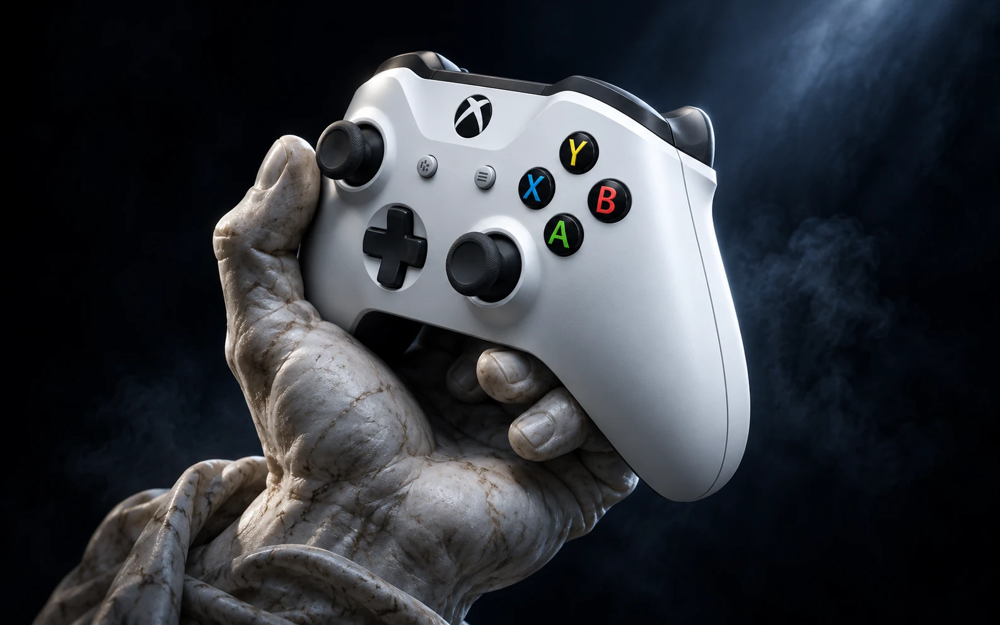

<div align="center">

# ODAN

**Do teclado e mouse para um controle virtual**

Um app para Windows que transforma teclado e mouse num controle de videogame<br/>que os jogos de PC reconhecem como um controle de verdade.

`C#` `.NET 8` `WPF` `MVVM` `DirectX 11` `SharpDX` `Helix Toolkit` `Assimp`<br/>
`Interception` `ViGEmBus` `ASP.NET Core` `Google Firestore` `Docker` `xUnit`

</div>

---

## Sumário

1. [Visão geral](#1-visão-geral)
2. [Números](#2-números)
3. [O problema](#3-o-problema)
4. [Como funciona](#4-como-funciona)
5. [Arquitetura](#5-arquitetura)
6. [Captura de input](#6-captura-de-input)
7. [Mapeamento](#7-mapeamento)
8. [Calibração do mouse](#8-calibração-do-mouse)
9. [Presets](#9-presets)
10. [Macros](#10-macros)
11. [Perfis](#11-perfis)
12. [Réplica 3D do controle](#12-réplica-3d-do-controle)
13. [Performance](#13-performance)
14. [Licenciamento](#14-licenciamento)
15. [Interface](#15-interface)
16. [Qualidade e testes](#16-qualidade-e-testes)
17. [Desafios técnicos](#17-desafios-técnicos)
18. [Stack completa](#18-stack-completa)
19. [Status](#19-status)

---

## 1. Visão geral

O ODAN captura o teclado e o mouse, traduz cada comando e entrega ao jogo como se fosse um **controle de Xbox conectado ao PC**. Para o Windows e para o jogo, não existe teclado nenhum: existe um controle.

Foi feito em **C# (.NET 8)** com WPF, calibra a resposta de cada comando em tempo real e mostra uma **réplica 3D do controle** que reage a cada botão.

> Começou como um experimento para entender como os jogos leem dispositivos de entrada.

## 2. Números

| Métrica | Valor |
| --- | --- |
| Código do app (C#) | ~15 mil linhas |
| Projetos na solução | App WPF, testes, API de licenças e ferramentas de validação |
| Controle emulado | Xbox 360 (via ViGEmBus) |
| Parâmetros de calibração por perfil | Sensibilidade, curva, zona morta e suavização |
| Presets prontos | FPS, RPG, Ação e padrão |
| Renderização 3D | DirectX 11, MSAA 2x, SSAO |

## 3. O problema

Muitos jogos de PC foram pensados para controle. Alguns dão vantagens para quem joga no controle, como o *aim assist*; outros simplesmente funcionam melhor assim. Mas muita gente prefere a precisão do mouse.

As soluções que existiam tinham três problemas:

1. o jogo recebia **teclado e controle ao mesmo tempo** e ficava trocando o ícone dos botões ou travando a mira;
2. o mouse virava um analógico **duro ou "escorregando"**, sem calibração fina;
3. a ferramenta **pesava no PC** e derrubava o FPS.

O ODAN foi construído para resolver os três.

## 4. Como funciona

```text
Teclado / mouse
      │
      ▼
Captura em nível de driver (Interception)
      │   o input original é suprimido: o jogo não o recebe
      ▼
Mapeamento ─────────────── tecla → botão · mouse → analógico
      │
      ▼
Calibração ─────────────── sensibilidade · curva · zona morta · suavização
      │
      ▼
Controle virtual (ViGEmBus) ──────────────► jogo
      │
      └──► Réplica 3D na interface, reagindo em tempo real
```

## 5. Arquitetura

O app segue **MVVM**: a interface WPF só exibe dados; a lógica fica nos serviços, atrás de interfaces.

```text
┌──────────────────────────── Interface (WPF) ─────────────────────────────┐
│ Dashboard · Mapeamento · Configuração · Perfis · Controle 3D · Ativação │
└──────────────────────────────────┬───────────────────────────────────────┘
                                   │ bindings / commands
                          ┌────────▼────────┐
                          │  MainViewModel  │
                          └────────┬────────┘
       ┌──────────────────┬────────┴─────────┬───────────────────┐
       ▼                  ▼                  ▼                   ▼
 IInputInterceptor   IInputMapper    IInputModeManager    Licensing / Sessão
 (captura)           (tradução)      (nativo ↔ emulação)   (API + Firestore)
       │                  │
       ▼                  ▼
 Interception        ViGEmBus ──► controle Xbox 360 virtual
```

| Serviço | Responsabilidade |
| --- | --- |
| `InputInterceptorService` / `InterceptionInputService` | Captura teclado e mouse no nível do driver |
| `SuppressedInputStateTracker` | Controla quais teclas foram suprimidas para não "prender" nenhuma ao trocar de modo |
| `InputMapperService` | Traduz cada input para botão, gatilho, direcional ou analógico |
| `InputModeManager` | Alterna entre modo nativo e modo emulação |
| `SessionManager` / `SessionStore` | Sessão da licença e renovação |
| `LicensingApiClient` | Comunicação com a API de licenças |
| `DeviceFingerprintService` | Impressão digital do hardware para vincular a licença |

## 6. Captura de input

O ODAN intercepta o teclado e o mouse **no nível do driver** (Interception), antes que o Windows entregue o input ao jogo.

- No **modo emulação**, as teclas mapeadas viram controle e **o jogo não recebe o original**. Isso acaba com a troca constante entre "modo teclado" e "modo controle" dentro do jogo.
- No **modo nativo**, tudo passa direto, sem tradução, para usar o PC normalmente.
- Uma **tecla de atalho** alterna entre os dois modos na hora, e outra mostra ou esconde o cursor do mouse.
- O rastreador de teclas suprimidas garante que nenhuma tecla fique "presa" quando o modo muda no meio de um movimento.

## 7. Mapeamento

Qualquer tecla ou botão do mouse pode virar qualquer parte do controle:

| Parte do controle | Mapeável para |
| --- | --- |
| A · B · X · Y | Qualquer tecla ou botão do mouse |
| LB · RB | Qualquer tecla ou botão do mouse |
| LT · RT (gatilhos) | Pressão analógica simulada |
| Direcional (DPad) | Teclas individuais |
| Analógico esquerdo | Teclas de movimento (ex.: WASD) |
| Analógico direito | Movimento do mouse |
| L3 · R3 · Start · Back · Guide | Qualquer tecla |

O mapeamento é feito clicando no botão do controle e apertando a tecla desejada. A mudança vale na hora.

## 8. Calibração do mouse

A parte mais difícil do projeto é fazer um mouse, que tem movimento relativo e sem limite, parecer um analógico, que tem posição absoluta e limite. Cada perfil ajusta:

| Parâmetro | Para que serve |
| --- | --- |
| **Sensibilidade** | Quanto o analógico inclina para cada movimento do mouse |
| **Curva de resposta** | Precisão em movimentos curtos e velocidade nos longos; abaixo de 1 fica mais agressiva, acima de 1 fica mais suave |
| **Zona morta** | Evita que o analógico "vaze" ou trema quando o mouse está parado |
| **Suavização** | Tira a tremida sem criar atraso perceptível |

- Os sliders aceitam **valor digitado**, para ajuste fino.
- A **zona morta é visualizada** num gráfico, para ver exatamente onde o analógico começa a responder.
- Tudo pode ser ajustado **com o jogo aberto**, e o efeito aparece na réplica 3D na hora.

## 9. Presets

Para quem não quer calibrar do zero, há presets aplicados com um clique:

| Preset | Sensibilidade | Zona morta | Curva | Para quem |
| --- | --- | --- | --- | --- |
| **FPS** | 1,5 | 0,05 | 0,7 (agressiva) | Mira rápida e precisa |
| **RPG** | 1,0 | 0,10 | 1,2 (suave) | Câmera tranquila |
| **Ação** | 2,0 | 0,03 | 0,5 (muito agressiva) | Movimento rápido |
| **Padrão** | 1,0 | 0,10 | 1,0 | Ponto de partida |

## 10. Macros

O ODAN tem macros configuráveis, como repetir um botão em sequência:

- tecla de ativação própria;
- **atraso** configurável entre os toques;
- modo **loop**, que repete enquanto estiver ativo;
- botão de **testar macro** antes de usar no jogo;
- status da macro visível no painel.

## 11. Perfis

Cada jogo pode ter seu próprio perfil, com mapeamento, calibração e macros:

- criar, **renomear**, **duplicar** e excluir perfis (com confirmação);
- definir um **perfil padrão**;
- marcar perfis **favoritos**;
- vincular um perfil a um **jogo específico**;
- **exportar e importar** perfis para compartilhar ou fazer backup.

## 12. Réplica 3D do controle

A interface mostra um controle 3D renderizado com **DirectX 11** através do **Helix Toolkit (SharpDX)**:

- modelo importado de um arquivo **GLB** via **Assimp**, com um carregador próprio de cena;
- **iluminação física** para o material parecer plástico de verdade;
- **MSAA 2x** para bordas lisas;
- **SSAO** (oclusão de ambiente) para dar profundidade entre as peças;
- **física vetorial por botão**: cada botão afunda e volta, cada gatilho desce proporcionalmente à pressão e cada analógico inclina conforme o movimento.

Isso não é só estética: é a forma mais rápida de ver se o mapeamento e a calibração estão certos sem abrir um jogo.

## 13. Performance

O ODAN não pode custar FPS ao jogo:

- com o jogo aberto, o ODAN vai para **segundo plano**;
- o uso da **GPU** pela interface é reduzido enquanto o jogo roda;
- o FPS do jogo tem prioridade sobre a réplica 3D;
- a captura e a tradução do input rodam fora da thread da interface.

## 14. Licenciamento

O ODAN é distribuído com um sistema de licenças próprio:

```text
App ODAN ──► API de licenças (ASP.NET Core) ──► Google Firestore
   │                   │
   │                   ├── ativar
   │                   ├── renovar sessão
   │                   ├── desativar
   │                   └── status
   │
   └── impressão digital do hardware (a licença fica presa ao PC)
```

- **API em ASP.NET Core**, empacotada em **Docker**;
- dados em **Google Firestore**, com regras de segurança e índices próprios;
- licença vinculada ao dispositivo por **impressão digital do hardware**;
- **sessões com renovação automática** enquanto o app está aberto;
- **painel administrativo** para gerar chaves, ver estatísticas e ativar ou suspender licenças.

## 15. Interface

| Tela | O que tem |
| --- | --- |
| **Dashboard** | Botão de iniciar/parar a emulação com LED de status, réplica 3D e resumo do perfil ativo |
| **Mapeamento** | Controle clicável para ligar cada botão a uma tecla |
| **Configuração** | Sliders de calibração, visualização da zona morta, presets e busca de configurações |
| **Perfis** | Cards de perfil com favorito, padrão, duplicar, renomear, exportar e importar |
| **Ativação** | Entrada e verificação da chave de licença |

Detalhes de acabamento:

- **notificações toast** (sucesso, erro, aviso e info) que somem sozinhas;
- **indicador de status na barra de título**;
- botão de emulação com brilho animado quando ativo;
- tema escuro com cor de destaque.

## 16. Qualidade e testes

- Projeto de testes com **xUnit**.
- **Ferramenta própria de validação dos analógicos**, que mede a resposta do stick virtual para cada configuração.
- Ferramenta de diagnóstico do driver de captura.
- Validações de build antes de cada versão.

## 17. Desafios técnicos

| Desafio | Solução |
| --- | --- |
| Jogo recebendo teclado e controle ao mesmo tempo | Captura em nível de driver com supressão do input original |
| Teclas "presas" ao trocar de modo | Rastreador de estado das teclas suprimidas |
| Mouse não tem posição absoluta como um analógico | Conversão com sensibilidade, curva, zona morta e suavização |
| Renderização 3D pesando no jogo | Segundo plano e redução do uso da GPU com o jogo aberto |
| Distribuir sem pirataria fácil | Licença vinculada ao hardware com sessão renovável |

## 18. Stack completa

| Camada | Tecnologias |
| --- | --- |
| **App** | C#, .NET 8, WPF, MVVM |
| **3D** | Helix Toolkit, SharpDX (DirectX 11), Assimp (GLB) |
| **Input** | Interception (driver de captura), ViGEmBus (controle virtual) |
| **Backend** | ASP.NET Core, Google Firestore, Docker |
| **Qualidade** | xUnit, ferramentas próprias de validação |

## 19. Status

**Funcional.** O código não é aberto; este repositório documenta o projeto.

Quer saber mais? Me chama.

---

<div align="center">

Feito por [Carlos Daniel](https://github.com/spullxxx) · [LinkedIn](https://www.linkedin.com/in/carlos-daniel-18787b362/) · [Instagram](https://www.instagram.com/carlaoodan/)

</div>
